# Tileset
 bgwall1

 bgwall2

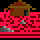 bldgbk

 bonus1

 bonus2

 bonus3

 bonus4

 bonus5

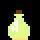 bottle1

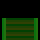 box1

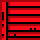 box2

 box3

 bubble

 bubblend

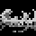 cloud

 cover1

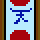 cover3

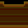 cover3a

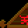 cover3b

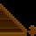 cover3c

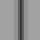 divhor

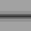 divver

 extra1

 extra2

 extra3

 extra4

 extra5

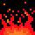 fire

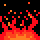 fire1

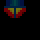 frlight1

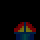 frlight2

 frligon1

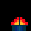 frligon2

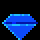 gem1

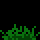 grass1

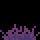 grass2

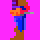 hiro-1

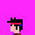 hiro-2

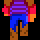 hirob1b

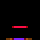 hirob1h

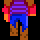 hirob2b

 hirob2h

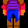 hirofb

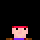 hirofh

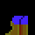 hirol1

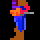 hirol1b

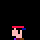 hirol1h

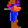 hiror1b

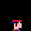 hiror1h

 hp1

 infloor1

 infloor2

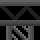 infloor3

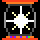 invulner

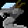 kobra

 kobral1

 kobral2

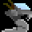 kobrar1

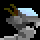 kobrar2

 ladder

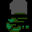 mansnake

 moon

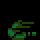 ms

 mtnbk

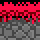 outflo1

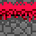 outflo2

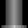 pillar1

 pillar2

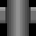 pillar3

 pillar4

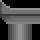 pillar5

 pillar6

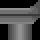 pillar7

 pipe3

 pipebk

 rdfkrbkb

 rdflrb1b

 sky1

 speed1

 spklcel1

 wall1bl

 wall1itl

 wall1tr

 wall2

 wall3

 wall4

 wall5

 wall6

 wall7

 wall8

 wep1

 wep2

 wep3

 wep4

 wep5

 wep8

 wire1

 wire2

