# Tileset
 bgwall1

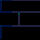 bgwall2

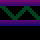 infloor2

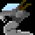 kobral1

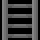 ladder

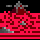 mtnbk

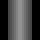 pillar2

 pillar6

 pipe3

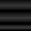 pipebk

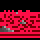 rdfkrbkb

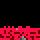 rdflrb1b

 sky1

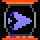 speed1

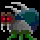 spklcel1

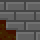 wall1bl

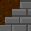 wall1itl

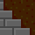 wall1tr

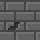 wall2

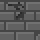 wall3

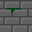 wall4

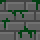 wall5

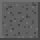 wall6

 wall7

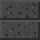 wall8

 wep1

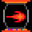 wep2

 wep3

 wep4

 wep5

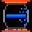 wep8

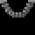 wire1

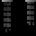 wire2

